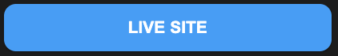
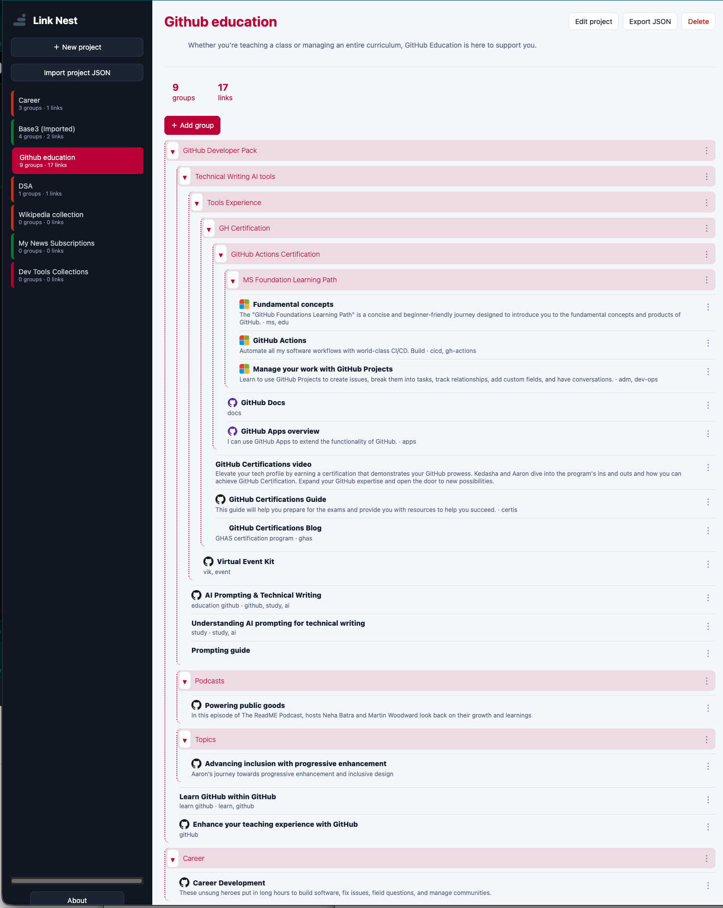

#  Link Nest: Organize Your Digital Garden

Welcome to **Link Nest**, the open-source application designed to help you organize links into projects, groups, and subgroups frictionless. Built as lightweight, entirely on the web stack (HTML, CSS, JavaScript) with a focus on local storage, Link Nest is the perfect companion for researchers, developers, students, and lifelong learners.

   
  
 

## 📖 Getting Started

### Prerequisites
No installation required! Link Nest is a pure web application.

## 🏗️ Tech Stack & Architecture

Link Nest is built with simplicity and performance in mind. No build tools, no frameworks—just clean, maintainable standards:

*   **Structure:** Semantic HTML5
*   **Style:** Modern CSS3 (Flexbox/Grid, Variables)
*   **Logic:** Vanilla JavaScript (ES6+)
*   **Storage:** `localStorage` API

This minimal dependency footprint ensures the app runs instantly, loads quickly on any device, and is incredibly easy for developers to audit or extend.

## ✨ Key Features

### 📂 Project Architecture
*   **Unlimited Projects:** Create separate silos for different domains of interest (e.g., "React Learning," "History of Art," "Startup Ideas").
*   **Deep Nesting:** Organize chaos with unlimited levels of groups and subgroups. Your digital filing system, infinite depth.
*   **Smart Link Management:**
    *   Add **Reasons** (Why did you save this? To read later? For reference?).
    *   Set **States** (Read, In Progress, Reference).
    *   Attach **Tags** for cross-project indexing.
    *   Auto-fetch **Site Icons** for quick visual recognition.

  
  

---

*Disclaimer: Link Nest is an open-source project. While I have reviewed the code for general usability, please conduct your own research regarding specific local data storage permissions within your browser environment.*

---
> "If you would like to help improve the application, fix a bug, or suggest a new feature, please join us at GitHub Repository."

**[🔗 Go to Link Nest on GitHub](https://github.com/sergio-ottovini/link-nest)** 

---

## 📜 License

This project is licensed under the **MIT License**.
This means you are free to use, modify, and distribute this software for personal or commercial projects. We release it into the public domain to encourage innovation and sharing.

See the [LICENSE](https://github.com/sergio-ottovini/link-nest/blob/main/LICENSE) file for details.

---

## 📬 Contact & Community

We value your feedback!
*   **GitHub Issues:** [Link Nest Issues](https://github.com/sergio-ottovini/link-nest/issues)

Thank you for interesting Link Nest with your knowledge.

🌿 Let's build a better digital garden together. 

